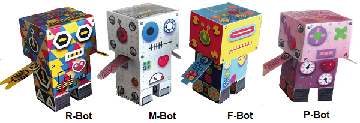
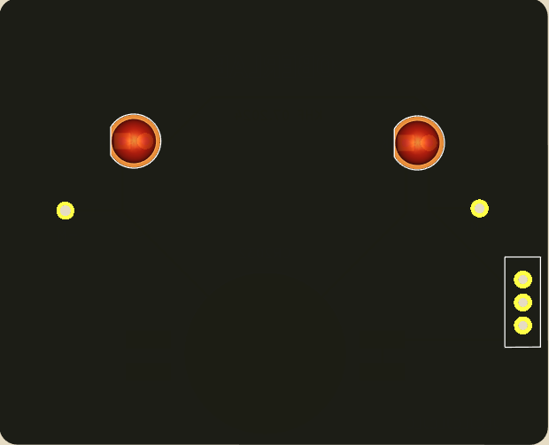
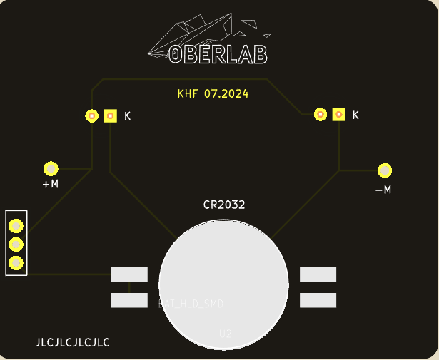

  |[:skull:ISSUE](https://github.com/frankyhub/PaperBot/issues?q=is%3Aissue)|[:speech_balloon: Forum /Discussion](https://github.com/frankyhub/PaperBot/discussions)|[:grey_question:WiKi](https://github.com/frankyhub/PaperBot/wiki)|
|--|--|--|
| | | |
||||
||| |

# PaperBots
PaperBots mit RGB-LEDs

Platine mit RGB-LEDs

 

